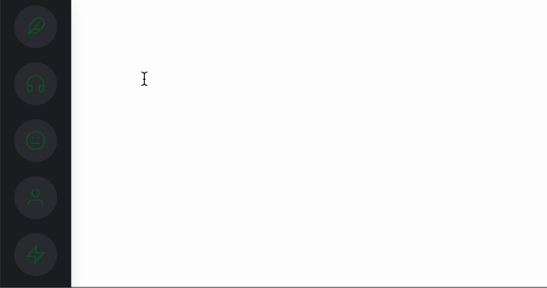

# Animated Navbar with Tooltip

用 Tailwind 做的一个类似 Discord Navbar 的 Navbar，悬浮到图标上的动画效果和 Discord 中的一样。

## Resources
1. [react-icons](https://react-icons.github.io/react-icons/)

## Reference
- [Ultimate Tailwind CSS Tutorial // Build a Discord-inspired Animated Navbar](https://www.youtube.com/watch?v=pfaSUYaSgRo&ab_channel=Fireship)
- [Discord-Inspired Dashboard with Tailwind CSS](https://github.com/fireship-io/tailwind-dashboard)